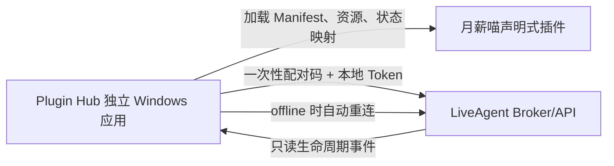

# LiveAgent Plugin Hub / 月薪喵扩展：Grill 摘要

**日期**：2026-09-28
**状态**：已完成需求访谈，可进入技术调研与 spec
**来源**：用户在本轮 grill-me 中确认的产品决策；当前项目 `.workflow/config.json` 已初始化

## 🎯 问题

用户希望在不修改 LiveAgent 主 UI、且不妨碍 LiveAgent 官方更新的前提下，为 LiveAgent 增加可独立安装和管理的扩展能力。

第一阶段不做完整插件生态，而是先做一个独立的 Plugin Hub，并用第一款宠物插件验证完整闭环。

第一款插件是“月薪喵”适配插件，当前仅供个人使用。

## 💡 解决方案轮廓

`apps/plugin-hub` 是当前仓库中的独立应用目录。最终产物是独立的 Windows 桌面应用，不修改 LiveAgent 主 UI。

Plugin Hub 自己负责：

- 插件导入、安装、启用、禁用、卸载和状态展示
- 宠物插件的资源加载和桌面渲染
- 与本机 LiveAgent 的配对和重连
- 将 LiveAgent 状态映射为宠物动画

宠物插件是声明式资源包，不执行任意代码，也不启动额外进程。第一版插件包包含：

- Manifest
- 宠物资源
- LiveAgent 状态到动画/表情的映射

LiveAgent 只需要提供稳定的 Broker/API。Plugin Hub 首次连接使用一次性配对码和本地 Token，插件只能读取状态并订阅事件。



这张图回答“宠物插件由谁渲染、LiveAgent 提供什么、断线如何处理”。没有画公共市场、MCP、自动化和 UI 嵌入，因为它们明确不在第一版范围内。

## 📌 已确认的事实与决策

### 产品范围

- 用户原话：第一版“做一个插件的 Hub，目前先做宠物扩展部分”。
- Plugin Hub 第一版支持：导入、安装、启用/禁用、卸载、状态。
- 优先平台：Windows。
- 插件来源：本地、ZIP、GitHub、URL。
- 插件安装和启用严格分离；安装后默认不启用。

### 解耦边界

- 用户选择：只增加稳定 Broker/API，不改 LiveAgent 主 UI。
- Plugin Hub 自己渲染宠物。
- 当前仓库内新增 `apps/plugin-hub`，但最终构建为独立应用。
- 不把宠物 UI 注入 LiveAgent React 树，也不要求修改 LiveAgent 页面结构。

### 宠物能力

- 第一款插件：月薪喵适配插件，个人使用。
- 宠物窗口：透明、无边框、可拖动、置顶、托盘菜单。
- 首版状态集合：`idle`、`working`、`waiting`、`success`、`error`、`offline`。
- LiveAgent 未连接时，宠物继续显示 `offline` 状态并自动重连。
- Broker 权限：只能读取状态和订阅事件；不读取对话、工具结果、本地文件，也不控制 LiveAgent。

### 安全与范围

- 安装时进行 Manifest 校验并要求用户确认。
- 个人使用 MVP 暂不要求插件签名。
- 明确不做：公共 Marketplace、任意 JS/Rust 插件、插件外部进程、MCP Connector、自动化、Provider、声明式 UI 嵌入和完整对话数据。

### 验收主路径

```text
导入月薪喵
→ Manifest 校验
→ 安装但保持禁用
→ 用户显式启用
→ Plugin Hub 显示桌宠
→ 配对本机 LiveAgent
→ LiveAgent 状态驱动宠物动画
→ 断开时进入 offline 并自动重连
→ 可禁用或卸载插件
```

## ✅ 验收标准

1. Windows 上可以启动独立 Plugin Hub，不需要修改 LiveAgent 主 UI。
2. 用户可以从本地目录、ZIP、GitHub 或 URL 导入月薪喵插件。
3. Hub 会校验 Manifest；安装完成后插件默认处于禁用状态。
4. 用户可以显式启用、禁用、卸载插件，并看到安装/运行状态。
5. 月薪喵插件只使用声明式 Manifest、资源和状态映射，不执行任意代码、不启动子进程。
6. Hub 可以通过一次性配对码和本地 Token 连接 LiveAgent Broker/API。
7. 宠物只接收六类只读状态：`idle`、`working`、`waiting`、`success`、`error`、`offline`。
8. LiveAgent 暂时离线时，宠物显示 `offline`，Hub 后台自动重连。
9. 主演示流程可以完整跑通：导入 → 安装 → 启用 → 显示桌宠 → 状态驱动动画。

## 🚫 范围外

- 公共插件市场、发布审核和社区分发
- 任意 JS、Rust 或脚本代码插件
- 插件启动独立子进程
- MCP Connector、Hook、Cron、Webhook 和其他自动化
- Provider、Embedding、图像或语音模型扩展
- LiveAgent 主 UI 内嵌第三方组件
- 读取完整对话、系统 Prompt、工具结果、长期记忆或本地文件
- 通过宠物控制、暂停或停止 LiveAgent 任务
- 插件签名、代码沙箱和供应链审计
- 第一版插件升级、回滚和依赖解析

## ❓ 未决与需要调研

1. LiveAgent 当前代码中应在哪里增加最小 Broker/API，以及是否能在不改主 UI 的情况下接入。
2. 本机 Broker 的具体传输方式：Named Pipe、loopback HTTP 或其他 IPC。
3. 一次性配对码、Token 生成、存储、撤销和过期策略。
4. `liveagent.extension/v1` 与宠物插件 Manifest 的字段和版本兼容规则。
5. Plugin Hub 的 Tauri/React 项目结构、Windows 打包和托盘实现方式。
6. 月薪喵适配所需的公开来源、资源格式和个人使用许可边界。
7. GitHub/URL 导入的下载、缓存、解压、路径穿越防护和错误恢复流程。

## ⏭️ 下一步

先运行 `/wf-research`，调研 LiveAgent 当前架构、Broker 接入点、Windows 桌面实现和月薪喵资源来源；完成后运行 `/wf-to-spec` 生成正式 spec。
