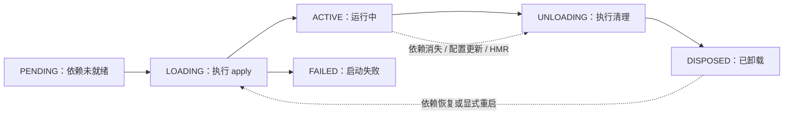

# DeepSeek Harness 插件架构调研

## 🎯 问题

BetterLiveAgent 是否应该参考 DeepSeek Harness，把“插件”从静态资源包提升为可组合的运行时扩展？如果参考，哪些机制可以借鉴，哪些安全边界不能照搬？

本次调研重点关注：插件形态、Bundle/Profile、服务与事件、生命周期、配置更新、安装分发和信任边界。

## ✅ 结论

**DeepSeek Harness 的插件不是单纯的 Manifest 或资源包，而是由宿主运行时加载的代码插件。** 插件可以是函数、类或带 `apply` 的对象，能够注册服务、事件、工具和清理逻辑；Cordis 内核负责挂载、卸载、依赖和生命周期。官方页面明确把模型、工具、技能、会话、沙箱、存储、循环、调度和 UI 都视为可替换插件。[^harness]

**最值得借鉴的是“稳定能力接口 + 可组合配置 + 可逆生命周期”，不是直接复制它的代码插件信任模型。** DeepSeek Harness 官方安全文档明确警告：项目可以执行模型生成的代码和命令、加载第三方插件，并访问网络、进程、凭证和文件；沙箱和审批不能被视为绝对隔离。[^safety]

因此，BetterLiveAgent 应分成两层：

- `resource.plugin`：Manifest、图片、动画、状态映射等声明式资源。适合月薪喵，Hub 自己渲染，不执行第三方代码。
- `trusted.code.plugin`：类似 DeepSeek Harness 的代码 Bundle，只允许开发者模式或用户明确批准，未来再做，不作为普通插件的默认形态。

这能同时满足“类似 DeepSeek Harness 的可组合插件架构”和“桌宠插件不打穿本机权限边界”这两个目标。

## 🧩 DeepSeek Harness 的核心模型

### 1. 一切能力通过插件组合

DeepSeek Harness 官方页面把插件能力覆盖范围定义为模型、工具、技能、会话、沙箱、存储、循环、调度和 UI。Cordis 内核只负责插件挂载、卸载和依赖关系，具体 Agent 能力由插件提供；开发者可以通过配置选择、替换或扩展能力，而不用修改 Harness 源码。[^harness]

仓库架构文档进一步说明：模型适配器、工具注册表、会话日志和 Agent Loop 都是插件；插件注册被视为可逆 effect，插件卸载时会撤销。[^architecture]

### 2. 插件入口是运行时代码

Cordis Registry 支持三种插件入口：函数、构造器/类、带 `apply` 的对象。插件可以声明 `inject` 依赖、`provide` 服务以及配置 schema。[^registry]

这意味着 DeepSeek Harness 的普通插件模型是“可信宿主代码”模型：插件代码进入宿主运行时，并不是只被当作图片、JSON 或静态资源读取。这个判断来自官方 Registry API 和 Host Runner 文档；官方没有宣称普通插件具备 OS 级安全沙箱。

### 3. Bundle 与 Profile 分工

DeepSeek Harness 把“可分发的插件”和“运行组合”分开：

- **Bundle**：npm 包，包含 `package.json`、`dsh.bundle` manifest、配置 patch 和插件代码。
- **Profile**：一个运行组合，包含已安装 Bundle 列表、依赖和用户自己的 `cordis.patch.yml`。

Bundle 通过 patch 插入或覆盖插件行；Profile 按顺序组合多个 Bundle，后层可以覆盖前层配置。官方教程明确指出，Bundle 是作者发布和分发的单位，Profile 是用户启动的组合，二者不能混为一谈。[^publish]

这对 BetterLiveAgent 很有价值：

```text
Plugin Package = 插件包本身
Plugin Profile = 一组已启用插件及其配置
Plugin Hub     = 管理安装包、Profile 和生命周期
```

### 4. 服务接口解耦实现

Cordis 使用命名服务连接插件，而不是让插件直接依赖另一个插件的具体实现。例如 `ctx.tools`、`ctx.llm` 和 `ctx.agents` 都是服务；插件通过 `inject` 声明自己依赖哪些服务，服务未就绪时插件不会启动。服务提供者消失时，依赖它的插件会自动卸载；服务恢复后再加载。[^service]

官方还推荐把可替换能力拆成三种角色：

1. Service Definition：稳定定义请求、结果和服务接口。
2. Service Provider：提供具体实现。
3. Consumer：调用该能力或把它暴露给模型。

三者只依赖 Service Definition，不互相依赖具体实现。[^capability]

对 BetterLiveAgent 的映射：

```text
Extension API Definition  = agent.state / events / plugin.lifecycle 的协议
LiveAgent Broker Provider = 真正读取 LiveAgent 状态并发布事件
Plugin Hub Consumer       = 订阅状态并渲染宠物、管理插件
```

### 5. 事件是松耦合通信机制

Cordis 通过 `ctx.on()` 监听、`ctx.emit()` 广播，并提供 `bail`、`serial`、`waterfall` 等不同事件语义。事件可以用 TypeScript declaration merging 做类型约束；插件卸载时，事件监听器会自动移除。[^events]

BetterLiveAgent 不需要复制全部事件模式。第一版只需定义一个稳定、只读、可版本化的事件流：

```text
agent/state-changed
agent/connection-changed
agent/plugin-permission-changed
```

其中宠物只订阅状态变化，不读取对话正文、工具参数或工具结果。

## 🔁 生命周期与可逆清理

每个加载的插件实例由一个 Fiber 表示。Fiber 持有插件状态、校验后的配置、依赖信息和注册的 effect。官方生命周期为：



`ctx.effect()` 会立即执行 effect，并收集返回的清理函数；Fiber 卸载时按逆序执行清理。`dispose()` 会递归卸载子插件，并等待异步清理完成；`restart()` 和 `update()` 也走同一套卸载/重载路径。[^fiber][^lifecycle]

这部分可以直接借鉴到 BetterLiveAgent 的 Plugin Manager：

- 启用插件时创建一个明确的运行实例。
- 禁用插件时必须撤销它订阅的所有事件和窗口资源。
- 插件异常进入 `failed`，不应让 Hub 或 LiveAgent 崩溃。
- 状态和清理记录要可诊断。

## 📦 安装、配置和 HMR

DeepSeek Harness 的 Plugin Manager 管理 Profile 中的插件：启用/禁用插件条目、选择 Bundle、安装或移除外部 Bundle。配置变化在启用 HMR 时可以立即应用，否则要等重启。官方文档还说明，安装新的 Bundle 默认会启用它；这与我们已确认的“安装后默认禁用”不同。[^manager]

官方发布教程显示，安装可以来自本地目录、链接包或 GitHub；Profile 用包管理器维护依赖，Bundle 的 patch 层负责把代码插件接入运行时。GitHub 安装是源码安装，不等于已经得到构建产物，TypeScript 插件需要额外处理构建输出。[^publish]

对 BetterLiveAgent 的决定：

- 可以借鉴 **Bundle / Profile / Manager** 三层结构。
- 月薪喵资源插件的安装后状态仍保持 `disabled`，不照搬 DeepSeek Harness 的“安装即启用”。
- 第一版不需要 HMR；先做卸载、启用、禁用和失败恢复。
- URL/GitHub 导入必须先下载到隔离缓存目录，校验 Manifest 和资源路径，再原子安装。

## ⚠️ 信任边界不能照搬

DeepSeek Harness 的官方 `SAFETY.md` 明确说明：

- 项目处于 developer preview。
- 它可以执行模型生成的代码和命令。
- 它可以加载第三方插件。
- 它可能接触网络、进程、凭证和文件。
- 沙箱、审批和权限控制可以降低风险，但不保证隔离。
- 官方建议使用最小权限、一次性环境或虚拟机，并审查插件、配置和命令。[^safety]

Host Runner 文档也明确写出：动态包运行在 `node:vm` realm 中，但这只是全局对象隔离，不是安全边界；宿主服务仍然可以触达真实运行时。已安装 Host code 会在进程内执行，并位于工作区沙箱之外。[^hostrunner][^manager]

所以 BetterLiveAgent 第一版必须坚持：

- 月薪喵插件只允许 Manifest + 静态资源 + 状态映射。
- 不允许插件执行 JS、Rust、PowerShell 或任意脚本。
- 不允许插件启动子进程。
- 不允许插件读取 LiveAgent 配置、密钥、文件或完整会话。
- 不允许普通插件调用任意 Broker 方法。
- 如果未来增加代码插件，必须单独标记为 `trusted.code.plugin`，并使用开发者模式、明确授权和更强的审计机制。

## 🧭 对 BetterLiveAgent 的影响

### 直接借鉴

1. **Plugin / Profile / Hub 分层**：插件包、启用组合和管理界面分开。
2. **稳定能力接口**：定义 `liveagent.extension/v1`，插件只依赖协议，不依赖 LiveAgent 内部文件。
3. **服务与消费者分离**：Broker 提供状态服务，Plugin Hub 消费状态服务。
4. **事件命名空间**：使用 `agent/*`、`connection/*` 等版本化事件名。
5. **可逆生命周期**：启用、禁用、重启和卸载都必须有明确清理路径。
6. **Profile**：为不同场景保存不同插件组合，例如 `pet`、`skills-manager`、`developer`。
7. **诊断信息**：记录插件状态、最近错误、版本、资源数量和最近一次事件。

### 暂不借鉴

1. 不把普通插件当作宿主 JavaScript/TypeScript 代码执行。
2. 不使用 `node:vm` 或类似机制作为安全沙箱。
3. 不允许插件默认访问 Shell、文件系统、网络、凭证或进程。
4. 不把安装和启用绑定在一次操作中。
5. 不在第一版复制完整 Cordis 事件模式、HMR、动态代码包和包管理器执行链。

### 推荐的 BetterLiveAgent 插件模型

```text
Plugin Package
├── manifest.json
├── assets/
│   ├── idle.png / idle.gif / idle.webp
│   ├── working.*
│   ├── waiting.*
│   ├── success.*
│   ├── error.*
│   └── offline.*
└── state-map.json
```

建议的 Manifest 方向：

```json
{
  "schema": "betterliveagent.plugin/v1",
  "id": "personal.monthly-cat",
  "name": "月薪喵",
  "version": "0.1.0",
  "kind": "resource.plugin",
  "hostApi": ">=1.0 <2.0",
  "permissions": [
    "agent.state.read",
    "agent.events.subscribe"
  ],
  "entry": {
    "assets": "assets",
    "stateMap": "state-map.json"
  }
}
```

这里的 `kind` 是关键：它明确告诉 Hub 这是资源插件，而不是可执行代码插件。

## 📚 依据

- [DeepSeek Harness 官方介绍](https://www.deepseek.com/harness/en/)：定义“一切皆插件”、Cordis 内核、能力插件和配置组合。
- [DeepSeek Harness Architecture](https://github.com/deepseek-ai/deepseek-harness/blob/master/docs/architecture.md)：说明 Cordis、Profiles、Bundles、patch 层和可替换产品组件。
- [Cordis Registry API](https://github.com/deepseek-ai/deepseek-harness/blob/master/docs/cordis-api/registry.md)：说明函数/类/对象插件、配置 schema、`inject` 和 `provide`。
- [Cordis Fiber API](https://github.com/deepseek-ai/deepseek-harness/blob/master/docs/cordis-api/fiber.md)：说明 Fiber、effect、dispose、restart 和 update。
- [Cordis 生命周期教程](https://github.com/deepseek-ai/deepseek-harness/blob/master/docs/user/develop/framework/index.zh.md)：说明状态机、依赖重载、清理和 HMR。
- [Services and dependencies](https://github.com/deepseek-ai/deepseek-harness/blob/master/docs/user/develop/framework/service.md)：说明服务、依赖、提供者替换和隔离。
- [Event system](https://github.com/deepseek-ai/deepseek-harness/blob/master/docs/user/develop/framework/events.md)：说明事件模式、类型化事件和自动移除监听器。
- [Package and install a plugin](https://github.com/deepseek-ai/deepseek-harness/blob/master/docs/user/develop/basic/publish.md)：说明 Bundle/Profile manifest、安装、依赖和 patch 层。
- [Plugin Manager](https://github.com/deepseek-ai/deepseek-harness/blob/master/packages/boot/plugin-manager/README.md)：说明安装、启用/禁用、HMR、审批和 Host code 执行边界。
- [Cordis Host Runner](https://github.com/deepseek-ai/deepseek-harness/blob/master/packages/extensions/cordis-host-runner/README.md)：说明动态包、`node:vm` 运行环境和“不是安全边界”的限制。
- [SAFETY.md](https://github.com/deepseek-ai/deepseek-harness/blob/master/SAFETY.md)：说明 developer preview、第三方插件和本机权限风险。

## 🔬 查证过程

| 预想 | 让它站不住的材料 | 现在的写法 |
|------|------------------|------------|
| DeepSeek Harness 的插件主要是静态配置 | Registry 明确支持函数、类和对象插件；Bundle 包含插件代码与 patch | 它是运行时代码插件系统，Manifest 只是分发/配置入口 |
| `node:vm` 可以提供安全沙箱 | Host Runner 明确写出 sandbox 不是 security boundary，宿主服务仍可触达真实运行时 | 不能把代码插件安全地开放给普通用户 |
| 安装插件就等于启用插件 | Plugin Manager 文档说明安装新 Bundle 默认启用 | BetterLiveAgent 保留“安装/启用分离”作为有意的安全改造 |
| 可以直接复制 Cordis 的全部能力 | 当前需求只需要状态事件和宠物资源，完整 HMR、动态包、事件模式会扩大复杂度 | 先借鉴接口、Profile 和生命周期，暂不复制运行时代码机制 |
| 桌宠应该直接作为代码插件接入 | 宠物只需要资源和状态映射，不需要宿主代码权限 | 月薪喵先做 `resource.plugin`，未来再考虑受信任代码插件 |

## ⏳ 不确定的部分

1. DeepSeek Harness 当前版本的全部插件 API 仍处于 developer preview，官方页面明确表示核心插件和 API 会继续变化；不能把它的接口当成稳定标准。
2. 官方资料没有证明其插件系统提供 OS 级沙箱、资源配额、签名验证或完整供应链审计；这些能力不能假设存在。
3. BetterLiveAgent 当前目标 LiveAgent 仓库的实际 Broker 接入点、Tauri 窗口边界和状态事件来源仍需单独读源码确认。
4. 月薪喵具体素材、代码和可再分发权限尚未核验。个人下载和使用不等于可以把素材打包进公开插件。

## 🧭 对我们的影响

本次调研改变了一个重要判断：**BetterLiveAgent 不应只设计“资源插件”，而应设计一个未来可容纳代码插件的分层插件协议；但第一版只开放资源插件。**

建议下一步 `/wf-to-spec` 写成两个明确层级：

- Phase 1：`resource.plugin`，完成 Plugin Hub + 月薪喵 + Broker 只读状态事件。
- Phase 2：`trusted.code.plugin`，参考 DeepSeek Harness 的 Bundle/Profile/Fiber/Service/Event 思路，但另行设计权限、签名、隔离和审计，不直接加载任意第三方代码。

这能保留 DeepSeek Harness “Everything is a Plugin”的扩展方向，同时避免第一版把普通桌宠插件变成具有本机权限的宿主代码。

[^harness]: [DeepSeek Harness 官方介绍](https://www.deepseek.com/harness/en/)
[^architecture]: [DeepSeek Harness Architecture](https://github.com/deepseek-ai/deepseek-harness/blob/master/docs/architecture.md)
[^registry]: [Cordis Registry API](https://github.com/deepseek-ai/deepseek-harness/blob/master/docs/cordis-api/registry.md)
[^publish]: [Package and install a plugin](https://github.com/deepseek-ai/deepseek-harness/blob/master/docs/user/develop/basic/publish.md)
[^service]: [Services and dependencies](https://github.com/deepseek-ai/deepseek-harness/blob/master/docs/user/develop/framework/service.md)
[^capability]: [Three-role capability design](https://github.com/deepseek-ai/deepseek-harness/blob/master/docs/user/develop/practice/index.md)
[^events]: [Event system](https://github.com/deepseek-ai/deepseek-harness/blob/master/docs/user/develop/framework/events.md)
[^fiber]: [Cordis Fiber API](https://github.com/deepseek-ai/deepseek-harness/blob/master/docs/cordis-api/fiber.md)
[^lifecycle]: [Cordis lifecycle tutorial](https://github.com/deepseek-ai/deepseek-harness/blob/master/docs/user/develop/framework/index.zh.md)
[^manager]: [Plugin Manager](https://github.com/deepseek-ai/deepseek-harness/blob/master/packages/boot/plugin-manager/README.md)
[^hostrunner]: [Cordis Host Runner](https://github.com/deepseek-ai/deepseek-harness/blob/master/packages/extensions/cordis-host-runner/README.md)
[^safety]: [SAFETY.md](https://github.com/deepseek-ai/deepseek-harness/blob/master/SAFETY.md)
