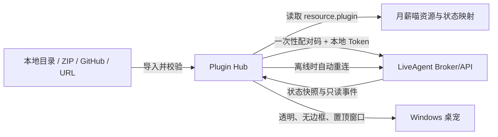

# LiveAgent Plugin Hub Phase 1 Spec

## 🎯 问题陈述

用户希望定制 LiveAgent，但不希望直接修改 LiveAgent 主 UI 或长期维护一个容易被官方更新覆盖的 Fork。

当前没有一个独立的扩展入口来管理插件，也没有一个安全、稳定的方式让外部桌面功能读取 LiveAgent 的有限状态。

第一阶段先用“月薪喵”桌面宠物验证插件闭环：用户导入插件、安装、启用后，独立 Plugin Hub 显示桌宠，并根据 LiveAgent 的生命周期状态切换动画。

## 💡 解决方案

在当前 BetterLiveAgent 仓库中新增独立应用 `apps/plugin-hub`。它最终作为 Windows 独立桌面应用运行，不注入 LiveAgent React 树，也不要求修改 LiveAgent 主 UI。

Plugin Hub 自己负责：

- 插件来源导入、Manifest 校验和安装
- 插件启用、禁用、卸载和状态展示
- 声明式宠物资源加载和桌面渲染
- 与本机 LiveAgent Broker/API 的配对、订阅和自动重连
- 将 LiveAgent 状态映射为宠物动画

第一阶段只开放 `resource.plugin`：插件包包含 Manifest、静态资源和状态映射，不包含可执行代码，不启动外部进程。

LiveAgent 侧只需要提供稳定的 `liveagent.extension/v1` Broker/API。Broker 只向月薪喵暴露状态读取和事件订阅能力。



这张图回答“插件从哪里来、谁负责渲染、LiveAgent 提供什么、断线如何处理”。没有画未来代码插件、MCP、自动化和公共市场，因为它们不属于 Phase 1。

## 👤 用户故事

1. 作为个人用户，我希望从本地目录、ZIP、GitHub 或 URL 导入一个宠物插件，以便不修改 LiveAgent 主程序也能增加桌宠。
2. 作为个人用户，我希望安装和启用分开，以便安装未知插件时不会立即运行或连接 LiveAgent。
3. 作为个人用户，我希望看到插件当前是已安装、已禁用、已启用还是失败，以便知道它是否正在运行。
4. 作为个人用户，我希望启用月薪喵后看到透明、无边框、可拖动、置顶的桌宠窗口，并能从托盘菜单管理它。
5. 作为个人用户，我希望桌宠只根据 idle、working、waiting、success、error、offline 切换表现，不暴露我的对话和工具结果。
6. 作为个人用户，我希望 LiveAgent 暂时退出时桌宠进入 offline 并自动重连，而不是让 Plugin Hub 崩溃。
7. 作为个人用户，我希望禁用或卸载插件后，窗口、事件订阅、Token 使用和临时资源都被清理。
8. 作为未来插件作者，我希望插件只依赖稳定的 Host API 版本，不依赖 LiveAgent 的内部文件路径或 React 组件。

## 🏗️ 实现决策

### 1. 插件类型分层

Phase 1 只接受：

```text
kind = resource.plugin
```

该类型只能声明：

- 插件身份和版本
- Host API 兼容范围
- 允许的只读权限
- 静态资源目录
- 状态映射文件

Phase 1 拒绝或忽略任何代码入口、脚本入口、子进程配置和未识别的高权限声明。

未来可以预留：

```text
kind = trusted.code.plugin
```

它可以参考 DeepSeek Harness 的 Bundle、Profile、Service、Event 和可逆生命周期，但必须另行设计授权、签名、隔离和审计；Phase 1 不实现，也不加载此类插件。

### 2. 插件包与 Manifest

插件包至少包含：

```text
manifest.json
assets/
state-map.json
```

Manifest 的 Phase 1 最小字段：

```json
{
  "schema": "betterliveagent.plugin/v1",
  "id": "personal.monthly-cat",
  "name": "月薪喵",
  "version": "0.1.0",
  "kind": "resource.plugin",
  "hostApi": ">=1.0 <2.0",
  "permissions": [
    "agent.state.read",
    "agent.events.subscribe"
  ],
  "entry": {
    "assets": "assets",
    "stateMap": "state-map.json"
  }
}
```

约束：

- `id` 是稳定标识，安装位置不能替代 `id`。
- `version` 使用可比较的版本格式。
- `hostApi` 不兼容时拒绝启用，但保留已安装包，不能静默删除。
- `permissions` 只能是 Phase 1 白名单中的两个只读权限。
- `entry.assets` 和 `entry.stateMap` 必须解析到插件包内部的相对路径。
- 所有路径必须拒绝 `..`、绝对路径、符号链接逃逸和解压目录外访问。
- 状态映射只能指向已校验的资源文件，不能指向 URL、脚本或动态表达式。

`state-map.json` 至少为六个状态提供资源映射：

```text
idle
working
waiting
success
error
offline
```

### 3. 插件来源与安装流程

Phase 1 支持四类来源：

- 本地目录
- ZIP 文件
- GitHub 来源
- HTTP(S) URL

GitHub/URL 必须先解析为受支持的插件目录或 ZIP；无法解析时给出明确错误，不执行任意仓库脚本。

安装流程固定为：

```text
选择来源
→ 下载或读取到临时目录
→ 校验包结构和 Manifest
→ 校验资源路径与大小边界
→ 展示插件身份、权限和来源
→ 用户确认
→ 原子移动到安装目录
→ 状态设为 installed/disabled
```

安装不等于启用。安装阶段不能：

- 启动插件进程
- 执行插件代码
- 访问 LiveAgent Broker
- 读取密钥
- 创建后台任务
- 注入工具或事件监听器

个人使用 MVP 暂不要求签名，但 UI 必须明确显示“未签名/个人来源”状态。

### 4. 插件生命周期

插件包生命周期与运行连接状态分开记录。

安装生命周期：

```text
not-installed
→ validating
→ installed-disabled
→ enabled
→ failed
→ disabled
→ uninstalled
```

连接状态：

```text
unpaired
→ pairing
→ connected
→ offline
→ reconnecting
→ connected
```

规则：

- 安装成功后始终进入 `installed-disabled`。
- 只有用户显式启用后，Plugin Hub 才加载资源、请求配对和订阅事件。
- 禁用必须停止渲染、取消事件订阅并释放插件相关窗口资源。
- 卸载前必须先禁用；卸载成功后删除插件安装目录和 Hub 管理的临时资源。
- 启动失败进入 `failed`，记录可读错误，不影响 Hub 或其他插件。
- 重新启用允许从 `failed` 回到 `enabled`，但不能无限快速重试。

### 5. Broker/API 边界

Broker 协议命名空间为：

```text
liveagent.extension/v1
```

Phase 1 只提供以下能力：

- `agent.state.read`：读取当前状态快照。
- `agent.events.subscribe`：订阅状态变化事件。

状态集合固定为：

```text
idle
working
waiting
success
error
offline
```

状态事件至少包含：

```json
{
  "type": "agent/state-changed",
  "state": "working",
  "occurredAt": "2026-09-28T00:00:00Z"
}
```

连接建立后，Broker 必须先返回当前状态快照，再发送后续事件，避免 Plugin Hub 在连接瞬间错过状态。

Broker 不向资源插件暴露：

- 完整对话
- 系统 Prompt
- 工具参数或结果
- 长期记忆
- API Key、OAuth Token 或其他密钥
- 任意文件内容
- 控制、暂停或停止 LiveAgent 的能力
- 任意 Shell、网络或本地进程能力

### 6. 配对与 Token

首次连接采用“一次性配对码 + 本地 Token”：

1. Plugin Hub 请求开始配对。
2. 用户在 LiveAgent 侧确认并输入或核对一次性配对码。
3. Broker 返回仅用于本机连接的 Token。
4. Hub 保存 Token，并在后续连接中使用它。
5. 用户可以在 LiveAgent 或 Hub 中撤销 Token，撤销后 Hub 回到 `unpaired`。

具体通信传输方式（Named Pipe、loopback HTTP 或其他本机 IPC）不在本 spec 中锁死，但实现必须满足：

- 只允许本机连接。
- 未配对的客户端不能读取状态。
- Token 不出现在普通日志、同步数据或插件包中。
- 配对失败、Token 失效和权限拒绝都返回可诊断错误。

### 7. Plugin Hub 桌面行为

Phase 1 的桌宠窗口必须支持：

- 透明背景
- 无边框
- 可拖动
- 置顶
- 托盘菜单

托盘菜单至少提供：

- 显示/隐藏桌宠
- 启用/禁用当前插件
- 打开 Plugin Hub 管理窗口
- 退出 Plugin Hub

LiveAgent 断开时：

- 桌宠继续显示；
- 当前状态切换为 `offline`；
- Hub 后台自动重连；
- 重连成功后先应用状态快照，再恢复事件订阅；
- 重连失败不得阻塞 Hub UI。

### 8. Profile 预留

参考 DeepSeek Harness 的 Profile 概念，Hub 内部可以把当前启用插件保存为默认 Profile，但 Phase 1 不提供多 Profile 编辑、继承、覆盖和依赖解析 UI。

未来 Profile 可以表达：

```text
pet
skills-manager
developer
```

Phase 1 只需要保证插件状态和配置不依赖某个固定 LiveAgent 内部文件路径。

### 9. 兼容与更新

插件通过 `hostApi` 声明兼容范围。LiveAgent Broker/API 发生不兼容变化时：

- Hub 必须把插件标记为 incompatible 或 disabled；
- 保留插件包和用户配置；
- 提供原因和可恢复动作；
- 不静默删除；
- 不自动执行插件升级。

Phase 1 不实现插件升级、回滚和依赖解析，但安装目录和状态模型必须为后续版本保留版本字段。

## 🧪 测试决策

测试外部行为，不测试具体组件名称、内部状态管理库或窗口实现细节。

### Manifest 与安装

- 合法 `resource.plugin` 可以通过校验。
- 缺少必填字段、错误版本、未知权限、未知 kind 会被拒绝。
- `..`、绝对路径、符号链接逃逸和包外路径会被拒绝。
- ZIP、目录、GitHub/URL 的成功和失败结果一致。
- 安装成功后状态是 `installed-disabled`，不能自动连接 Broker。
- 用户取消确认时不产生安装目录。
- 临时目录中的失败安装不会留下半成品。

### 生命周期

- `installed-disabled → enabled` 后才建立 Broker 连接。
- `enabled → disabled` 会停止渲染并取消订阅。
- `enabled → failed` 不影响 Hub 进程。
- `disabled → uninstalled` 会清理安装目录和临时资源。
- 不允许从 `not-installed` 直接进入 `enabled`。

### Broker 与配对

使用可控的 Fake Broker 或本机测试 Broker：

- 配对码正确时返回 Token。
- 配对码错误、过期或被撤销时拒绝连接。
- 未配对 Token 不能读取状态。
- 建连后先返回状态快照，再发送事件。
- 断开后进入 `offline`，重连成功后恢复最新状态。
- Broker 只暴露白名单能力，其他方法返回权限错误。

### 宠物渲染

使用测试资源包和确定性状态序列验证：

```text
idle → working → waiting → success → idle
```

并验证：

- 六类状态都能映射到资源。
- 缺失状态资源时显示可诊断错误或安全占位状态。
- `offline` 状态在断线后出现。
- 状态变化不会暴露对话正文、工具结果或 Token。
- 窗口行为满足透明、无边框、拖动、置顶和托盘菜单要求。

### 主验收演示

在 Windows 测试环境完成：

```text
导入月薪喵
→ Manifest 校验
→ 安装但保持禁用
→ 用户启用
→ 显示桌宠
→ 配对 LiveAgent
→ 状态驱动动画
→ 断开并显示 offline
→ 自动重连
→ 禁用并卸载
```

## 🚫 范围外

- 公共 Plugin Marketplace、发布审核和社区账号体系
- 任意 JavaScript、TypeScript、Rust、PowerShell 或其他脚本插件
- 插件启动独立子进程或 sidecar
- MCP Connector、Hook、Cron、Webhook 和其他自动化
- Provider、Embedding、图像或语音模型扩展
- LiveAgent 主 UI 内嵌第三方 React 组件
- 读取完整对话、系统 Prompt、工具参数、工具结果或长期记忆
- 通过桌宠控制、暂停或停止 LiveAgent 任务
- 插件签名、代码沙箱、SBOM 和供应链审计
- 插件升级、回滚、依赖解析和多 Profile 编辑
- HMR、动态代码包和完整 Cordis 事件语义

## 📎 附注

### 与 DeepSeek Harness 的关系

DeepSeek Harness 的研究结论保存在：

```text
.workflow/research/deepseek-harness-plugin-architecture.md
```

本 spec 借鉴了它的：

- Plugin / Profile / Manager 分层
- 稳定 Service Definition
- 事件命名空间
- 可逆生命周期和清理
- 失败状态与诊断

本 spec 有意不复制它的代码执行信任模型。普通用户安装的月薪喵只能是声明式 `resource.plugin`。

### 当前未锁死的实现选择

以下事项需要在实现 ticket 或 prototype 中验证，不改变本 spec 的外部行为：

- Broker 使用 Named Pipe、loopback HTTP 还是其他本机 IPC。
- Token 使用系统凭据存储还是其他本地安全存储。
- Plugin Hub 具体使用的 Windows 桌面窗口技术。
- GitHub/URL 如何解析为目录或 ZIP，以及下载缓存策略。
- 月薪喵素材的来源、授权和是否允许随个人插件包保存。

### 参考材料

- [Grill 摘要](../handoffs/grill-summary-2026-09-28.md)
- [DeepSeek Harness 插件架构调研](../research/deepseek-harness-plugin-architecture.md)
